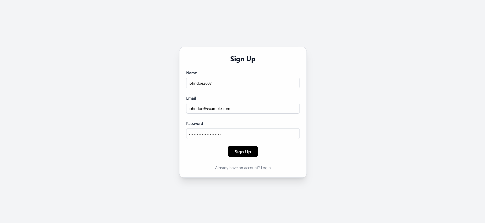
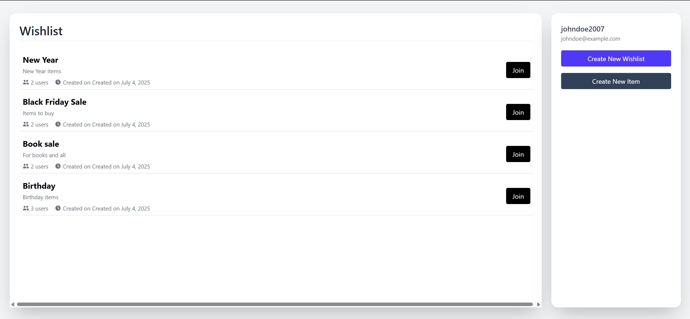
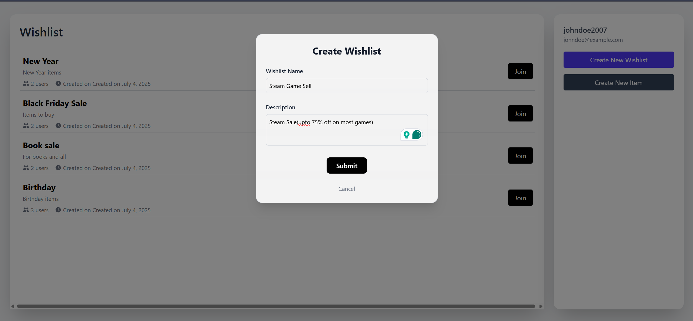
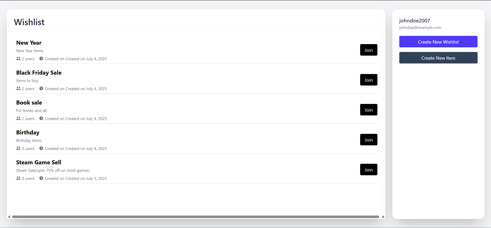
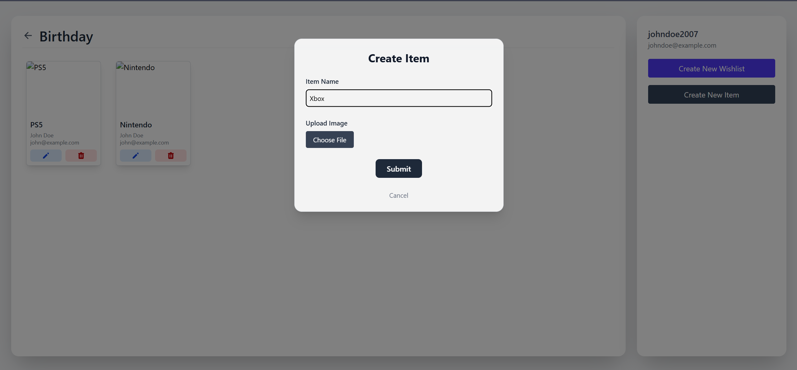
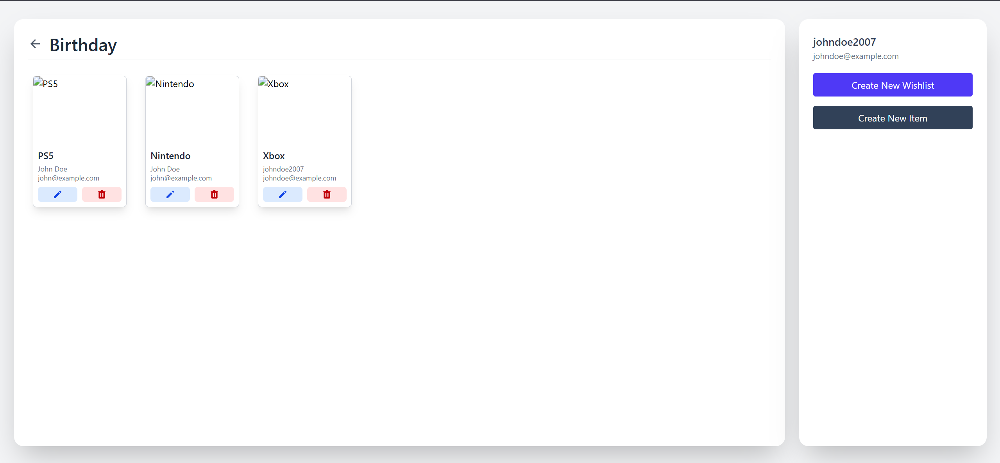

# Wishlist Manager

A lightweight web application to create, manage, and share wishlists. Built with a React frontend and Flask backend, it supports user authentication, item uploads with images, and real-time wishlist updates.

---
## How does it look?

<table style="width: 100%;">
  <tr>
    <td style="width: 50%;"></td>
    <td style="width: 50%;"></td>
  </tr>
  <tr>
    <td style="width: 50%;"></td>
    <td style="width: 50%;"></td>
  </tr>
  <tr>
    <td style="width: 50%;"></td>
    <td style="width: 50%;"></td>
  </tr>
</table>


## Features

- **User Authentication**: Sign up, log in, and maintain secure sessions.  
- **Wishlist Management**: Create wishlists, view others' wishlists, and join them.  
- **Item Management**: Add items to wishlists with names and image attachments.  
- **File Uploads**: Upload local images with preview support.  
- **Product API**: Full CRUD API available for product-related operations.  
- **REST API**: Backend exposes structured endpoints for frontend consumption.
---

## Note

For now, the image path is hardcoded, but the file picker works and all core features are functional.

---

## Tech Stack

**Frontend:**
- ReactJS
- Tailwind CSS

**Backend:**
- Python (Flask)
- SQLAlchemy
- PostgreSQL

---

## Setup Instructions

### PostgreSQL Setup (with pgAdmin)

1. Install PostgreSQL and pgAdmin.

2. Open pgAdmin and connect to your local PostgreSQL server.

3. Create a new database - `flock`.

---

### Docker Setup

1. Open terminal and navigate to the root of the project.

2. Build Docker images:
   ```bash
   docker compose up --build
   ```
### Access the services

- Frontend: http://localhost:8000
- Backend (Flask): http://localhost:5000/